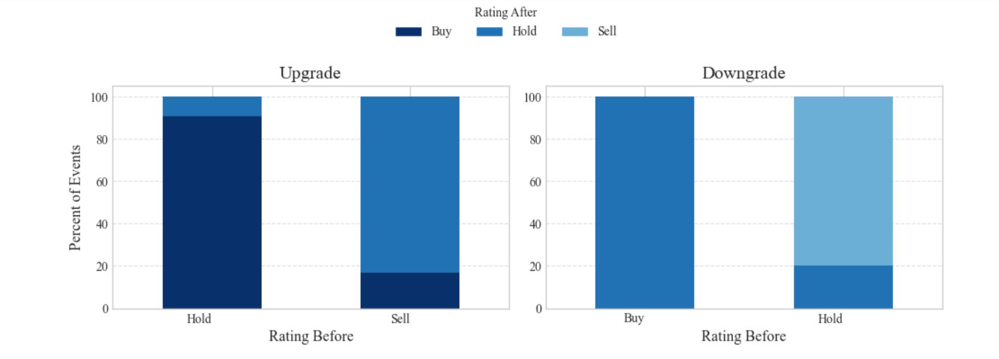
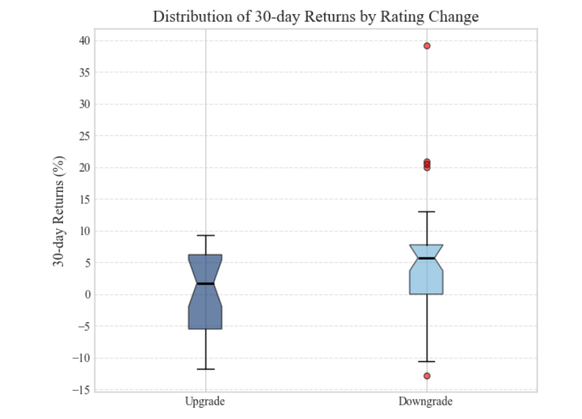

# Stock Price Target and Ratings Analysis and Insights
## Research Question: Do analyst upgrades lead to higher 30-day stock returns for large-cap consumer retail firms (e.g., SBUX, LULU, COST, ROST, AMZN)?
Names: Betanya Binyam, Gelila Solomon, Ngan Huynh, Seble Bedassa

### I. Executive Summary: 
This study examines whether analyst upgrades lead to higher 30-day stock returns for large-cap consumer retail firms, including SBUX, LULU, COST, ROST, and AMZN. Using analyst rating change data from AnaChart’s NASDAQ-100 dataset merged with adjusted closing stock prices at the time of the rating change (t=0) and 30 days later (t=30) [sourced from Yahoo Finance], we calculated post-announcement returns following analyst upgrades and downgrades.

We conducted visual analysis and a two-sample Welch’s t-test to compare average 30-day returns across upgrade and downgrade events. At a 5% significance level, we find that the average 30-day returns following analyst upgrades and downgrades are statistically different, suggesting that analyst rating changes are associated with distinct post-announcement stock performance.

### II. Basic Steps: 

1. **Problem Framing & Data Planning:** We formulated a research question examining whether analyst rating changes (upgrades and downgrades) are associated with differences in subsequent stock returns. Five large-cap consumer retail firms were selected for analysis (Starbucks, Lululemon, Ross, Amazon, and Costco). Data requirements were identified – including the dataframes extracted from the AnaChart dataset, adjusted closing stock prices in Yahoo Finance’s historical data, and formulas for calculations.
2. **Data Collection & Cleaning:** Analyst actions were classified into upgrades, downgrades, and no-change events. Observations with no rating change and duplicate entries were removed. Adjusted closing price data were then obtained from Yahoo Finance. For each upgrade and downgrade event, 30-day stock returns were calculated using adjusted prices at the event date (t=0) and 30 days after the event (t=30).
3. **Exploratory Data Analysis & Statistical Methods:** Visualizations including stacked bar charts and box plots were generated to explore patterns in returns following analyst rating changes. Summary statistics were computed for both 5-day and 30-day returns. A two-sample Welch’s t-test was conducted to compare mean returns following upgrades and downgrades, accounting for unequal variances across groups. The analysis indicates that average returns following downgrades exceeded those following upgrades, with the difference being statistically significant.
4. **Presentation & Documentation:** Final visualizations were prepared, and results were compiled into a presentation and written report. A structured project repository was created to document data sources, code, and outputs.

### III. Data Analysis and Visualizations:
**Figure A:**

**Figure A Description:**
**Upgrade Chart:** Most upgrades come from Hold → Buy not Sell → Buy , suggesting that analysts prefer incremental changes rather than sharp shifts. 
**Downgrade Chart:** Most downgrades come from Buy → Hold not Buy → Sell, reflecting cautious approach with analysts moderating views before choosing a bearish stance.

**Figure B**

**Figure B Description:**
This box plot shows the entire distribution highlighting: median performance, volatility, skewness, and outliers.
For upgrade, the median return is modest--the median line sits slightly above 0%, around 1-2%. Returns are also more clustered with the IQR relatively short from around -5% to +6%. The minimum and maximum values are closer together than for downgrades. There are very few dots above the upper whisker as well as no extreme gains like +20% or +40%.
There is wider dispersion for downgrade. This includes the downgrade box being taller than the upgrade box. The IQR spans a broader range around 0% to 8% with longer whiskers. Additionally, the boxplot shows the presence of large positive and negative outliers. There are also extreme dots around +20% to +40% and a large negative outlier at around-12%. Longer whiskers, more and farther outliers, and wider overall range suggests higher uncertainty and volatility.

### V. Insight and Interpretations:
The findings suggest that analyst rating changes may occur after relevant information has already been partially incorporated into stock prices, limiting their ability to generate positive abnormal returns following upgrades. This interpretation is consistent with semi-strong market efficiency, in which publicly available information is rapidly reflected in asset prices.

However, the statistical results indicate a significant difference between post-announcement returns following upgrades and downgrades. Using a two-sample Welch’s t-test, we reject the null hypothesis that upgrade and downgrade returns have equal means (t = −2.767, p = 0.008). Over the 30-day window, downgrades exhibited substantially higher average returns (mean = 5.7%) compared to upgrades (mean = 0.08%), despite greater variability in downgrade returns.

These findings suggest that analyst downgrades may convey more informative or corrective signals to the market than upgrades, potentially reflecting delayed price adjustments or investor overreaction. At the same time, the high standard deviations observed in both groups highlight the role of market noise and idiosyncratic factors. Short-horizon stock returns remain volatile, and analyst rating changes—particularly upgrades—do not guarantee predictable price movements over a 30-day horizon.

### VI. Limitations & Future Research:
#### Limitations:
One limitation of this study arises from gaps and missing values in the AnaChart dataset. Certain analyst rating observations were incomplete or recorded as null, potentially due to reporting inconsistencies, variations in analyst coverage across firms, or data collection constraints such as market holidays. As a result, the dataset may not fully capture all analyst recommendations or corresponding stock price responses.

The presence of missing data may introduce selection bias and measurement error, which could affect the precision and generalizability of the results. Consequently, the findings should be interpreted with caution, as they may not reflect the full population of analyst rating changes or market reactions.

#### Future Research:

Future research could examine shorter event windows, such as 5-day post-announcement returns, to assess whether market reactions to analyst rating changes occur more immediately rather than over a 30-day horizon. Additionally, extending the analysis beyond consumer retail firms to include other industries would help determine whether the observed patterns are sector-specific or more broadly applicable.

Further work could also investigate heterogeneity across firms and analysts by comparing the effects of rating changes issued by large versus small brokerages, or by examining differences between firms of varying market capitalizations. Such extensions could provide deeper insight into the conditions under which analyst ratings may carry greater informational value.

### Extension: 5-day returns

To examine whether the market reaction to analyst rating changes occurs over a shorter horizon, we extend the analysis to 5-day post-announcement stock returns. Using the same sample of analyst upgrades and downgrades, 5-day returns were calculated based on adjusted closing prices at the event date (t=0) and five trading days after the rating change (t=5).

We conducted exploratory data analysis and applied a two-sample Welch’s t-test to compare mean 5-day returns following upgrades and downgrades. The results were consistent with the 30-day analysis, indicating that average returns following downgrades exceeded those following upgrades. However, the magnitude of returns was smaller over the shorter window, suggesting that any market response to analyst rating changes is limited and short-lived.

This extension provides additional evidence that analyst rating changes do not generate consistently positive abnormal returns over short horizons and supports the interpretation that such information may be rapidly incorporated into prices.

